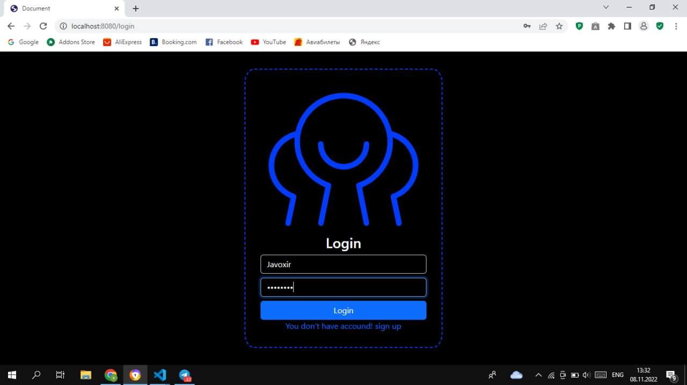

# Welcome to My Basecamp
Expressjs & sqlite3 project


### install this project
```
git clone https://github.com/JavohirTojiboyev/Basecamp.git
```

```
npm install && npm i nodemon -g
```

### Running server for development
```
npm start dev:start
```
### Or run server for review
```
npm start
```
# Features:

### User Registration

<p> User #new</p>
<p>User #show</p>
<p>User #create</p>
<p>User #destroy In summary, you should be able to create a new user, delete a user, and as a new user, create an account yourself.</p>

### Session

<p> User #sign_in</p>
<p> User #sign_out Users should be able to log in and log out.</p>

### Project

<p>Project #new</p>
<p>Project #show</p>
<p>Project #edit</p>
<p>Project #destroy Similar to the real Basecamp, users should be able to create, edit, and destroy a project.</p>

### Abilities 

<ul>
<li>Home</li>
</ul>

<ul>
<li>Auth</li>
</ul>

<p>If you don't have an account, you can create one.</p>

<ul>
<li>profilet</li>
</ul>

<ul>
<li>Comment</li>
</ul>

<ul>
<li>New project</li>
</ul>

<ul>
<li>Edit Profile</li>
</ul>

